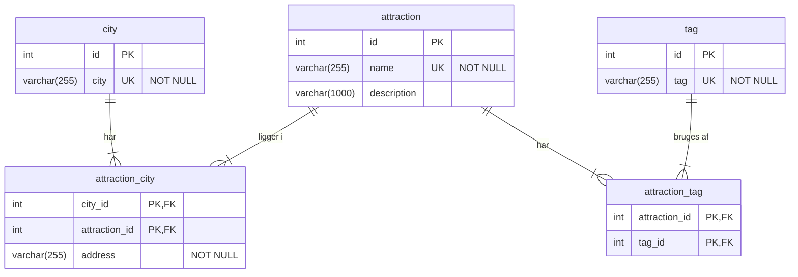

# Næveklubbens TouristGuideAPI ERD

```mermaid
erDiagram
    city ||--|{ attraction_city : "har"
    attraction ||--|{ attraction_city : "ligger i"
    attraction ||--|{ attraction_tag : "har"
    tag ||--|{ attraction_tag : "bruges af"

    city {
        int id PK
        varchar(255) city UK "NOT NULL"
    }

    attraction_city {
        int city_id PK, FK
        int attraction_id PK, FK
        varchar(255) address "NOT NULL"
    }

    attraction {
        int id PK
        varchar(255) name UK "NOT NULL"
        varchar(1000) description
    }

    attraction_tag {
        int attraction_id PK, FK
        int tag_id PK, FK
    }

    tag {
        int id PK
        varchar(255) tag UK "NOT NULL"
    }
```
